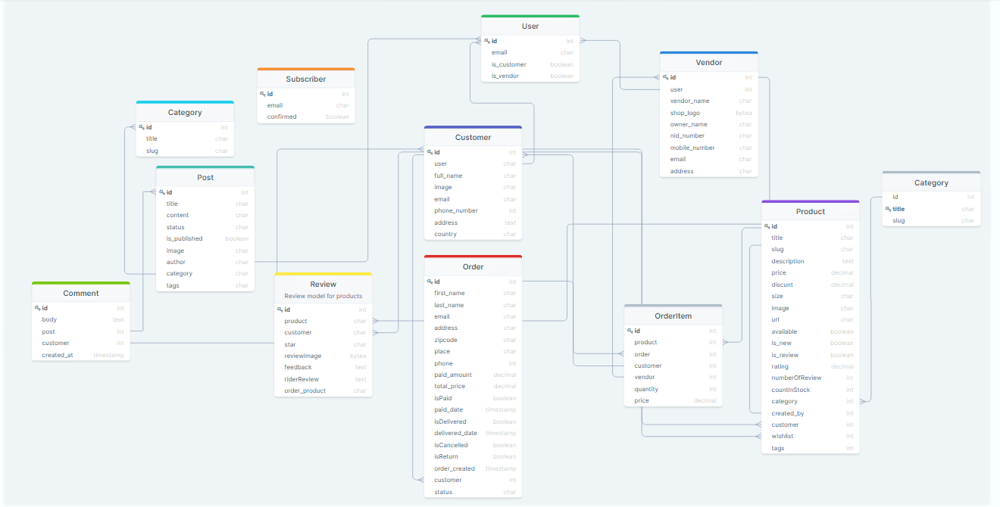

# DIGI e-commerce platform

A scalable advance multi vendor ecommerce software application with RBAC feature.

## The DIGI Diagram

--> *Preview :*

  

 

--> *Full View:*

You can see clearly the diagram at :&nbsp; 
## Introduction

The application is multivendor eCommerce platform with Role-based access control (RBAC) that empowers multiple vendors to sell their products from one storefront. Multivendor store gives shoppers a huge catalog to choose from and provides sellers with a bigger base of ready-to-buy customers.

 
\
 ## 🙏 Support

This project needs a ⭐️ from you. Don't forget to leave a star ⭐️

## 

Author:
<a href="https://www.linkedin.com/in/abiola-oladunjoye-8b61351a7/" target="_blank">Oladunjoye abiola </a> 
If you would like to have my help with your team and product, feel free to contact me. 🤓
<!-- Get in touch - End -->

